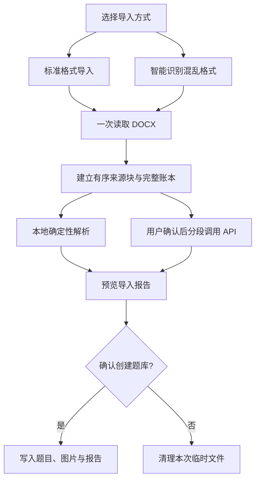

# QuizForge

QuizForge 是一个本地优先的 Android 刷题应用，可从 Word（`.docx`）导入单选题、多选题和判断题，并提供顺序练习、随机练习、错题重练、进度与掌握率统计。

## 两种相互独立的导入方式

### 标准格式导入（推荐）

- 完全离线，不读取 API Key，也不会产生模型费用。
- 按确定性规则解析题号、题干、选项、答案、题型、解析、知识点和图片。
- 适合按 QuizForge 格式整理的新题库；格式不合规的内容会进入导入报告，不会静默丢失。
- App 内可查看格式说明并保存真正的 Word 模板；仓库模板位于 [`app/src/main/assets/quizforge-standard-template.docx`](app/src/main/assets/quizforge-standard-template.docx)。

最小示例：

```text
1. 下面哪一项是正确答案？
A. 选项一
B. 选项二
C. 选项三
D. 选项四
答案：B
题型：单选
解析：可选
知识点：可选
```

### 智能识别混乱格式

- 面向自动编号、表格、集中答案区、一段多题等复杂 Word 结构。
- 选择文件时只在本机提取结构；必须由用户再次确认后才会调用 DeepSeek API。
- 模型获得的是分段后的题库文字及必要结构信息，不包含原始 DOCX 二进制或图片二进制。
- 每个模型结果都要经过来源校验、答案与选项校验、重复题检测；无法确认的内容保留在报告中。
- 需要用户自己的 API Key，费用由用户的 DeepSeek 账户承担。



## 导入可追溯性

每个非空段落、表格单元格和不支持的 Word 结构都进入来源账本，最终被标记为：

- 已生成题目
- 题目候选但被拒绝（附稳定原因码和原文）
- 非题目内容
- 暂不支持的内容

导入报告会记录题号、来源块、原文、失败原因、创建后的题目 ID、图片与表格数量，以及智能模式的 API 使用情况。报告与题库一起持久化。

## 数据与密钥安全

- API Key 使用 Android 加密存储；如果安全存储不可用，App 会拒绝保存 Key，不回退到明文。
- Key 所在设置文件已排除在云备份和设备迁移之外。
- 标准格式导入不读取 Key、不联网、不上传题库内容。
- 智能识别仅在明确确认后调用 API；调用前界面会说明发送内容、费用和不保证全部识别成功。
- 仓库不包含硬编码密钥或凭证。

## 其他功能

- 顺序刷题、随机刷题、错题重练
- 单次提交防重、答题记录持久化、已完成顺序练习的正确恢复
- 多图题干和多图选项显示
- 删除题库时同步清理题目、答题记录、进度与本地图片

## 技术栈

- Kotlin、Jetpack Compose、Navigation Compose
- Room
- Coroutines / Flow
- OkHttp
- OOXML（DOCX）结构解析

## 本地构建

要求：JDK 17、Android SDK 35、Android Studio 2024+。

```powershell
.\gradlew.bat test
.\gradlew.bat assembleDebug
.\gradlew.bat assembleAndroidTest
.\gradlew.bat lintDebug
```

## 文档

- [当前架构](docs/architecture.md)
- [智能识别接口与校验契约](docs/ai-repair-contract.md)
- [导入链路审计与整改说明](docs/import-audit.md)
