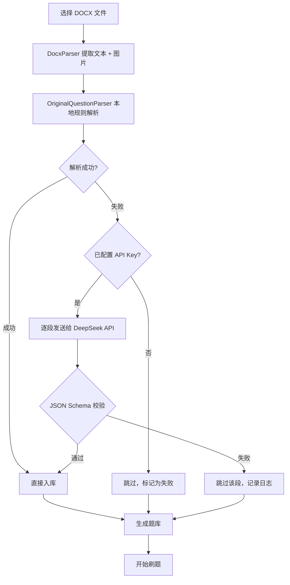

# QuizForge

Android 刷题 App，支持导入 Word/DOCX 题库文件，自动解析为刷题题库。解析失败的题目可通过用户配置的 DeepSeek API 进行 AI 修复。

## 功能

- **题库导入**：从 DOCX 文件导入题目，自动解析单选/多选/判断题
- **多种刷题模式**：顺序刷题、随机刷题、错题重练
- **AI 修复**：本地解析失败的题目，可调用 DeepSeek API 智能修复
- **答题统计**：记录答题正确率、进度追踪
- **图片支持**：支持题目中的图片显示

## 功能流程

## 截图

> 以下为 App 主要界面截图，请替换为实际截图。

| 首页题库列表 | 刷题界面 | 导入文档 |
|:---:|:---:|:---:|
|  |  |  |

| 答题反馈 | 设置页面 | AI 修复进度 |
|:---:|:---:|:---:|
|  |  |  |

## 技术栈

- Kotlin + Jetpack Compose
- Room 数据库
- Navigation Compose
- OkHttp
- MVVM 架构

## AI 修复原则

AI（DeepSeek API）仅用于修复 DOCX 解析后**结构异常**的题块，严格遵守以下约束：

- **不负责凭空生成答案**：AI 不能编造题目或答案
- **只修复结构异常题块**：将格式错乱的原文整理为规范的 JSON 结构
- **原文没有答案时 `answer = null`**：不推测、不补全
- **修复失败进入人工确认**：校验不通过的题块直接跳过，不在 App 内静默丢弃
- **所有 AI 输出必须经过 JSON Schema 校验**：详见 [AI 修复接口契约](docs/ai-repair-contract.md)

详见 [架构文档](docs/architecture.md) 和 [AI 修复接口契约](docs/ai-repair-contract.md)。

## 注意事项

- **API Key**：DeepSeek API Key 由用户在 App 设置页面本地输入，存储在设备本地，不会随项目上传或同步
- 本项目不含任何硬编码的密钥或凭证

## 本地运行

1. 用 Android Studio 打开项目根目录
2. 等待 Gradle 同步完成
3. 选择模拟器或连接真机，点击 Run 运行

要求：Android Studio 2024+、JDK 17、Android SDK 35
