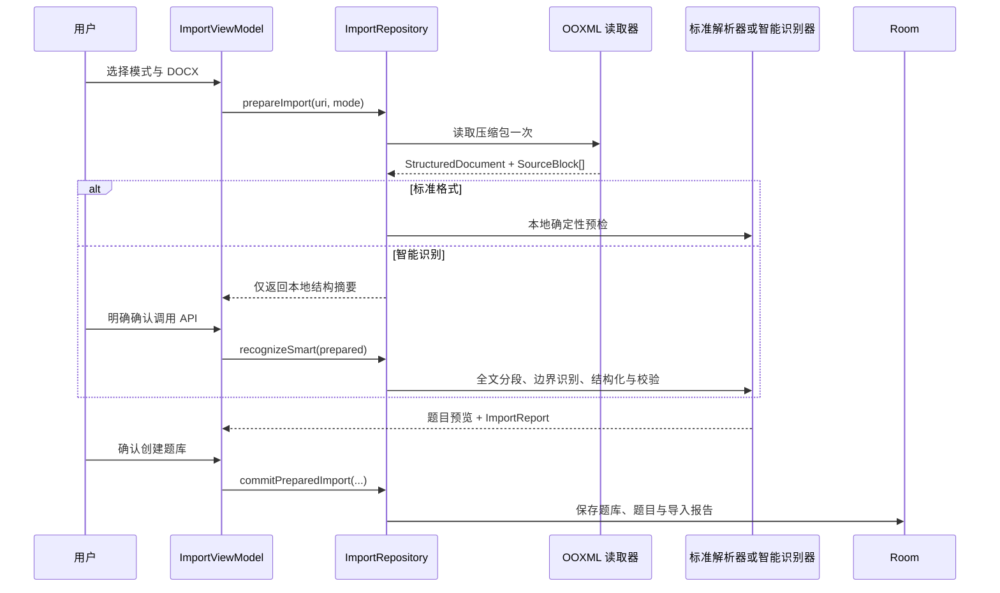

# QuizForge 当前架构

## 分层

```text
Compose UI
  Home / Quiz / Import / Settings
        │
ViewModel
  StateFlow + viewModelScope
        │
Repository
  QuizRepository / ImportRepository / SettingsStore
        │
Data and document services
  Room / OOXML reader / StandardFormatParser / SmartImportPipeline / DeepSeek API
```

## 导入任务生命周期

当前产品入口只提供 `STANDARD` 和 `SMART` 两种模式。二者共享一次 DOCX 读取和来源建模，但识别过程互不兜底、互不串联。



用户取消、离开页面或提交失败时，本次任务的临时目录和请求缓存会在后台清理；操作代次会立即失效，已取消协程的迟到回调不能覆盖新任务状态。提交中途失败会删除已创建的题库，避免残留半成品；应用启动时还会清理启动前快照到的上次进程遗留任务，不会触碰本进程新建任务。

## 统一来源模型

`OoXmlDocumentReader` 按 Word 原始顺序保留段落、表格、自动编号、图片关系和不支持的结构。`SourceBlockExtractor` 将其投影为稳定的 `ImportSourceBlock`：

- `sourceId` 与 `sourceOrder`：提供稳定来源定位和顺序。
- `rawText`：未改写的来源文字。
- `numbering`：Word 自动编号的编号 ID、层级与可见编号。
- `table`：表格来源 ID、行和列。
- `images`：同一来源块上的全部图片关系，而非只保留第一张。
- `unsupportedReason`：文本框、嵌入对象或不支持图片格式等显式原因。

`SourceLedger` 要求每个非空来源块最终具有状态，防止标题、集中答案区、异常内容和文件末尾内容在处理中消失。

## 标准格式导入

`StandardFormatParser` 是纯本地、确定性的解析器。它识别手工题号和 Word 自动编号，并解析题干、A–H 选项、答案、题型、解析、知识点与图片。标准模式具有以下约束：

- 不读取 API Key，不实例化智能兜底，也不发送网络请求。
- 不符合标准格式的题目候选会被拒绝并保留原文及原因码。
- 标题和说明被标记为非题目内容；不支持的 Word 结构被单独报告。
- 文件末尾的最后一道题会显式收束，不依赖下一道题触发保存。

## 智能识别

`SmartImportPipeline` 不以本地规则解析结果作为准入门槛。所有非空来源块都会进入边界识别请求；长文档按大小切片并保留相邻重叠来源块，单个超长块还会携带字符范围。

智能识别分为两步：

1. 边界阶段识别所有题目候选、集中答案区、非题目内容和无法确认内容；一个来源块可返回多道题。
2. 结构阶段为未完整结构化的候选补齐题干、选项、答案及各字段来源。

模型输出必须通过本地校验：来源 ID 必须存在、字段内容必须能在来源原文中得到支持、答案必须属于选项、题型有效、选项不重复，并拒绝重复题和疑似模型编造。仅成功响应会进入本次任务缓存，重试不会复用失败响应。

来源校验还受“本次请求范围”约束：边界响应只能引用当前分段实际发送的来源，结构响应只能引用候选来源和随请求发送的集中答案区；字段来源必须属于题目声明的来源集合。即使模型猜中了整篇文档中另一个真实 `sourceId`，也不能跨请求借用。

## 导入报告与持久化

`ImportReport` 汇总来源块、题目候选、接受/拒绝、非题目、不支持内容、图片、表格、警告、API 是否使用及逻辑模型批次数。`ImportReportRecord` 保留：

- 原题号、来源 ID 和原文
- 状态、稳定失败原因码与说明
- 创建后的题目 ID
- 是否尝试过 API

Room 使用 `ImportReportEntity` 和关联记录实体持久化这些信息。题目实体同时保存所有题干图片和选项图片的本地 URI。

## 设置与安全边界

- API Key 仅在 Android 加密存储可用时保存；加密初始化失败时返回空 Key 并拒绝写入明文。
- 标准格式路径不会读取 API Key；只有进入智能模式、设置页或用户确认后的智能识别才按需读取。
- 安全设置文件排除在 Android 云备份与设备迁移之外。
- 模型档位与 API 地址集中在 `ModelCatalog`，业务识别器不硬编码供应商细节。
- 连接测试只发送固定的最小测试消息，不包含题库内容。
- 智能识别发送提取后的题库文字、来源编号、表格坐标和图片引用标识，不发送原始 DOCX 或图片二进制。

## 兼容代码边界

仓库仍保留少量未接入产品路由的旧解析辅助类型，供既有单元测试使用。旧的对比入口、运行时开关和生产分支已经删除；Debug 与 Release 的普通导入都只能进入标准格式或智能识别两条路径。
