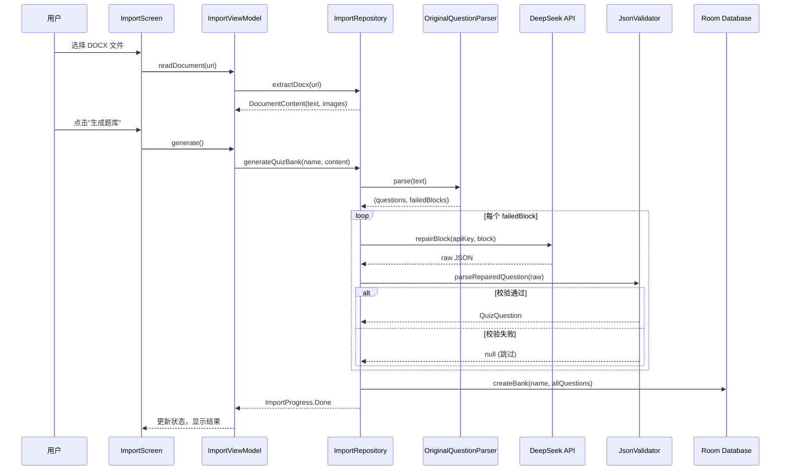

# QuizForge 架构文档

## 整体架构

```
┌─────────────────────────────────────────────┐
│                  UI Layer                    │
│  HomeScreen  QuizScreen  ImportScreen       │
│  SettingsScreen  CommonComponents           │
│  (Jetpack Compose + Navigation)             │
├─────────────────────────────────────────────┤
│               ViewModel Layer                │
│  HomeVM  QuizVM  ImportVM  SettingsVM       │
│  (StateFlow + viewModelScope)               │
├─────────────────────────────────────────────┤
│             Repository Layer                 │
│  QuizRepository  ImportRepository           │
│  SettingsStore                              │
├─────────────────────────────────────────────┤
│               Data Layer                     │
│  Room DB (AppDatabase)  DeepSeekApi (OkHttp)│
│  DocxParser  OriginalQuestionParser         │
│  JsonValidator  OptionTextSplitter          │
└─────────────────────────────────────────────┘
```

## 导入流程：规则解析 + AI 修复

题库导入采用**两阶段流水线**架构：

### 阶段一：本地规则解析

`OriginalQuestionParser` 使用正则规则解析 DOCX 纯文本：

```
DOCX 文本
    │
    ▼
splitBlocks()  ── 按题号分割为独立题块
    │
    ▼
parseBlock()  ── 逐块解析
    ├── 题号识别：^(第)?\d+[题.．、)]
    ├── 选项提取：^[A-H][.\．、:：)]
    ├── 选项合并：OptionTextSplitter 处理同行多选项
    ├── 答案提取：匹配"答案[:：]?\s*[A-H,，\s]+"
    ├── 解析提取：匹配"解析[:：]?\s*"
    ├── 知识点提取：匹配"知识点[:：]?\s*"
    ├── 判断题推断：答案含"对/错/正确/错误/√/×"
    └── 图片占位符关联
    │
    ▼
┌──────────────┬──────────────────┐
│ 成功 → 题目列表  │  失败 → failedBlocks │
└──────────────┴──────────────────┘
```

**解析成功条件**（全部满足）：
- 题干非空
- 至少解析出 2 个选项（判断题除外）
- 答案非空
- 答案中所有 key 在选项 key 集合中

### 阶段二：AI 修复（兜底）

`ImportRepository.generateQuizBank()` 对阶段一失败的题块逐一调用 DeepSeek API：

```
failedBlock (≤500 字符)
    │
    ▼
DeepSeekApi.repairBlock()  ── 非流式，temperature=0，max_tokens=2048
    │
    ▼
JsonValidator.parseRepairedQuestion()  ── 严格 JSON Schema 校验
    │
    ├── 通过 → 入库
    └── 失败 → 跳过，记录日志
```

**关键约束**：
- 每次只发送 **1 个 failedBlock**，不发送整篇文档
- Prompt 严格要求：不改写、不新增、不润色
- 无法识别时返回字面量 `null`
- 返回结果必须通过 `JsonValidator.parseRepairedQuestion()` 的完整 JSON Schema 校验

### 数据流示意



## 模块职责

### DocxParser
- 解压 DOCX（ZIP 格式）
- 解析 `word/document.xml` 提取纯文本和图片关系
- 输出 `DocumentContent(text, images)`

### OriginalQuestionParser
- 按题号正则分割文本块
- 逐块解析：题号、选项、答案、解析、知识点
- 行内多选项拆分（OptionTextSplitter）
- 判断题自动推断（无显式选项时生成 A/B 选项）

### DeepSeekApi
- 流式接口 `streamQuestions()`：用于批量生成（预留）
- 非流式接口 `repairBlock()`：用于单题修复
- 两个接口独立配置（流式 timeout=0，修复 mode timeout 默认）

### JsonValidator
- `parseQuestions()`：批量解析（支持截断恢复）
- `parseRepairedQuestion()`：严格单题校验
  - question 非空
  - options 非空，每项 text 非空
  - answer 非空，所有 key 必须在 options 中
  - 判断题必须仅有 A/B 选项，文本须为 对/错
  - 任一条件不满足 → 返回 null

### ImportRepository
- 协调两阶段流水线
- 通过 `Flow<ImportProgress>` 实时上报进度
- 图片关联（marker → URI）

### QuizRepository
- Room 数据库 CRUD
- 默认题库播种（`seedDefaultBankIfNeeded`）
- 答题记录与进度持久化
